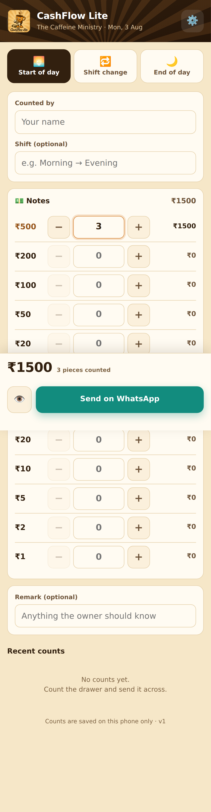

# 🧮 CashFlow Lite

A small phone app for counting the cash drawer at the **start of day**, at
every **shift change** and at the **end of day**. Staff enter how many of each
note and coin they hold, the app adds it up, and one tap sends the full
breakdown to the owner on WhatsApp — **+91 98292 22536**.



It is a standalone app. It shares no code, data or sign-in with BrewOps — it
just lives in this repository so that it deploys with the same Firebase
Hosting site.

## Where it lives

| | |
|---|---|
| Live | `https://tcm-orders.web.app/cash-counter/` |
| Also | `https://tcm-orders.firebaseapp.com/cash-counter/` |

Hosting serves the repository root, so the folder is published as-is — there
is nothing to build.

```bash
firebase deploy --only hosting     # from the repository root
```

Note that Firebase Hosting always uploads the **whole** site, not just this
folder: whatever the working tree holds at that moment becomes the live
BrewOps site too. Deploy from a tree you are happy to publish in full.

## Installing it on a phone

Open the link, then choose **Add to Home screen**. It installs as a normal app
icon, opens without browser chrome, and works offline — a service worker keeps
a copy of the app, so a count can be entered with no signal. Only the final
WhatsApp hand-off needs a connection.

## Using it

1. Pick **Start of day**, **Shift change** or **End of day**
2. Type your name (it is remembered next time)
3. Enter the quantity for each denomination — type a number, or use the
   **−** / **+** buttons
4. Add a remark if the owner should know something
5. Tap **Send on WhatsApp** — WhatsApp opens with the message ready; tap send

The 👁 button shows the exact message first, and can copy it to the clipboard —
useful if a phone's in-app browser refuses to open WhatsApp directly.

## What the owner receives

```
☕ *The Caffeine Ministry*
🧮 *CASH COUNT · END OF DAY* 🌙
━━━━━━━━━━━━━━━━━━
🗓 Mon, 03 Aug, 2026, 10:45 pm
👤 Counted by: Ramesh
🔁 Shift: Evening

💵 *NOTES*
₹500 × 2 = ₹1000
₹200 × 2 = ₹400
₹100 × 3 = ₹300
₹50 × 2 = ₹100
Notes subtotal: *₹1800*

🪙 *COINS*
₹20 × 5 = ₹100
₹10 × 4 = ₹40
₹2 × 3 = ₹6
₹1 × 5 = ₹5
Coins subtotal: *₹151*

━━━━━━━━━━━━━━━━━━
💰 *TOTAL CASH: ₹1951*
━━━━━━━━━━━━━━━━━━
26 notes & coins counted

📝 Remark: One ₹100 note is torn; kept aside.
```

## Settings & storage

The owner's number is built in as `+919829222536`. The ⚙️ button on the phone
can change the number and the shop name if they ever need to; those, the last
staff name, and the last 30 counts are kept in `localStorage` under
`tcm-cash-counter` — **on that phone only**. There is no server, no account and
no Firestore collection, so clearing the browser data clears the history.

Denominations are the Indian set — ₹500, ₹200, ₹100, ₹50, ₹20 and ₹10 notes,
and ₹20, ₹10, ₹5, ₹2 and ₹1 coins. Change the `DENOMS` list near the top of
the script in `index.html` for a different currency.

## The logo

`logo.png` (512×512) is the launcher icon; `logo-192.png` is the same badge at
192×192, used for the header and older Android launchers — the header draws it
at 46px, so it loads the small copy rather than the large one. Both are
resized from the original 1254×1254 artwork, which came in at 3.1 MB — too
heavy to ship to a phone on every open.

To change the logo, replace both files, keeping the names and sizes. If either
is missing the header falls back to a ☕ and the launcher to `icon.svg`, so a
bad file degrades rather than breaks.

## How the WhatsApp send works

The app opens a `https://wa.me/<number>?text=<message>` link, which hands the
pre-written message to WhatsApp on the phone; the staff member taps send — the
same approach BrewOps already uses to send purchase orders to vendors. It needs
no server, no API keys and no WhatsApp Business account, but it is **not** an
unattended send. Delivering without anyone tapping send would need the WhatsApp
Business API and a backend to call it.
